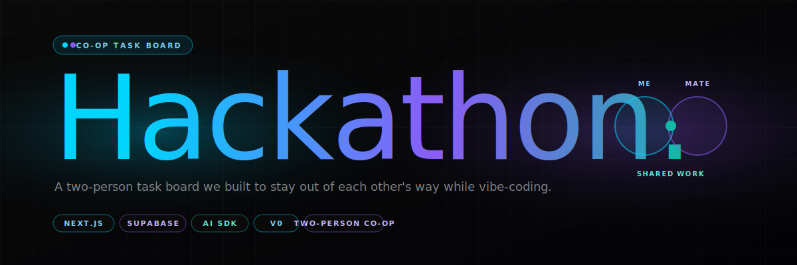

<div align="center">
  
</div>

<p align="center">
  
  
  
  
</p>

<br/>

> A two-person task board my mate and I built so we could actually stay out of each other's way while we were both new to coding. When you're vibe-coding through your first real projects with a friend, the hardest problem isn't the code — it's knowing what the other person is halfway through so you don't overwrite their work or build the same thing twice.

<br/>

## The story

This was the back-office for a run of side projects we shipped together early in our self-taught run. Two people, one codebase, neither of us had shipped real software before — the kind of pair where we were both figuring it out live, at the same time, occasionally at 1am.

We tried Trello. It was fine but the context-switch of opening a second tab to see who was doing what kept breaking the flow. So we built **this** — a tiny hackathon-style task board with:

- **Per-hackathon scopes** — each project we were working on is its own "hackathon", so tasks don't mix.
- **Team members with real identities** — not generic cards. You see who the task belongs to and what state it's in without thinking.
- **Shared and personal tabs** — tasks you own, tasks shared, tasks completed. Tabs keep the board from turning into soup.
- **Drag-and-drop reordering** — the list order matters because it doubles as priority.
- **Optional AI task generation** — paste the idea, generate a starting list of tasks. Saves the first 20 minutes of every new project.

It's not sophisticated. It's not a competitor to Linear. It's the tool that let two beginners ship software together without stepping on each other.

<br/>

## What's in the box

| | |
|---|---|
| **Task board** | Columns for shared, mine, and completed tasks. Drag-and-drop between them. |
| **Hackathons** | Scope tasks per project so working on two things at once doesn't get messy. |
| **Teams** | Join a hackathon via invite code. Each task has an assignee. |
| **Profiles** | Supabase auth with auto-created profiles on first sign-in (via RLS + service role on the server side). |
| **AI-generated starting tasks** | Groq + OpenAI via the Vercel AI SDK. Ideas in, seed task list out. |

<br/>

## Stack

| Layer | Tech |
|---|---|
| App framework | **Next.js** (App Router) · TypeScript |
| UI | **shadcn/ui** (Radix primitives) · Tailwind · glow effects on key surfaces |
| Database / Auth | **Supabase** — Postgres + RLS + auth users |
| LLM | **Vercel AI SDK** (`@ai-sdk/groq`, `@ai-sdk/openai`) for task generation |
| Initial scaffold | **v0.dev** — the first pass of the UI was vibe-coded there, then extended by hand |

<br/>

## Running locally

```bash
pnpm install

# Supabase project — create one at supabase.com, grab the keys
cp .env.local.example .env.local

# Required env vars
#   NEXT_PUBLIC_SUPABASE_URL
#   NEXT_PUBLIC_SUPABASE_ANON_KEY
#   SUPABASE_SERVICE_ROLE_KEY    (server-side, used for profile auto-creation)
#   GROQ_API_KEY                 (for AI task generation; OpenAI also supported)

pnpm dev
```

Supabase schema: `profiles`, `hackathons`, `team_members`, `tasks`. RLS is set up so users can only read rows tied to hackathons they've joined; the server route uses the service-role key for profile-creation on signup (the one place where the anon client can't reach).

<br/>

## Colour palette

Because it was a hackathon tool and hackathon tools should look like the 1am energy of building one:

| Token | Hex | Role |
|---|---|---|
| Cyan | `#00D4FF` | Primary — links, focused states, "me" |
| Purple | `#8B5CF6` | Accent — the other person, AI surfaces |
| Teal | `#14B8A6` | Complete, shared, overlap |
| Near-black | `#0a0a0a` | App background — OLED-dark |

The `.glow-effect` and `.text-glow` classes in `app/globals.css` are where the neon actually gets applied — blurred gradients underneath rounded rectangles, text-shadow on lit elements.

<br/>

## Status

Retired but kept alive. We used this through the stretch of projects we built together; by the end of that run we'd both graduated from "need a coordination board" to "just talk about it over DMs". The repo stays up as a time-stamp — evidence of what the process actually looked like when we were starting out, not a polished retrospective.

<br/>

## License

No license granted — source visible for portfolio purposes. If you want to actually build on it, [get in touch](https://github.com/KezLahd).

<br/>

---

<p align="center">
  <sub>Built with <a href="https://github.com/KezLahd">Kieran Jackson</a> · the early-vibe-coding days · 2025 · Another <a href="https://instagram.com/kieranjxn">Kez Curation ↗</a></sub>
</p>
